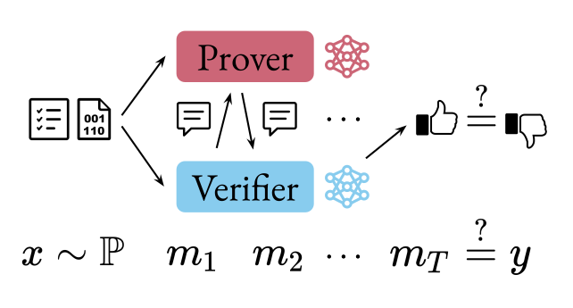
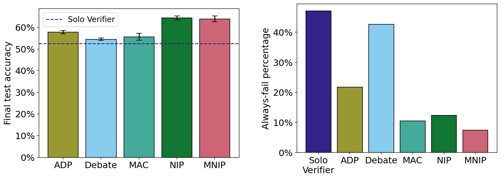

# Neural Interactive Proofs

_By Lewis Hammond and Sam Adam-Day_

<div markdown="1" class="links">

[arXiv](https://arxiv.org/abs/2412.08897) |
[OpenReview](https://openreview.net/forum?id=R2834dhBlo) |
[GitHub](https://github.com/SamAdamDay/neural-interactive-proofs) |
[Documentation](https://neural-interactive-proofs.com/docs)

</div>

In our [new paper](https://openreview.net/forum?id=R2834dhBlo), we study how a trusted, weak model can learn to interact with one or more stronger but untrusted models in order to solve tasks beyond the weak model’s capabilities. We introduce several new interaction protocols and evaluate them both theoretically and empirically alongside a range of earlier proposals. To facilitate further research on creating and evaluating different protocols for scalable oversight, we also provide a [comprehensive open-source codebase](https://github.com/SamAdamDay/neural-interactive-proofs).

```bibtex
@inproceedings{neural_interactive_proofs,
    author = {Lewis Hammond and Sam Adam-Day},
    title = {Neural Interactive Proofs},
    booktitle = {The Thirteenth International Conference on Learning Representations (ICLR)},
    year = {2025},
    eprint={2412.08897},
    archivePrefix={arXiv},
    primaryClass={cs.AI},
}
```


## Introduction

Recent years have witnessed the [proliferation of powerful machine learning systems](https://epoch.ai/trends), useful for solving an increasingly wide range of tasks. Often, however, it can be difficult to trust the output of these systems, raising concerns about their safety and limiting their applicability in high-stakes situations. At the same time, traditional approaches in verification do not scale to today’s most powerful systems. There is thus a pressing need to identify new angles via which to gain such assurances.

[One hope for solving this problem](https://www.alignmentforum.org/posts/LhxHcASQwpNa3mRNk/untrusted-smart-models-and-trusted-dumb-models) is to use weaker but trustworthy models to oversee stronger, untrusted models. Indeed, the idea of scalable oversight is at the core of several influential proposals for how to ensure the safety of AI systems even as they begin to exceed human capabilities (such as [iterated amplification](https://arxiv.org/abs/1810.08575), [recursive reward modelling](https://arxiv.org/abs/1811.07871), and [debate](https://arxiv.org/abs/1805.00899)). These proposals are in turn partially inspired by foundational results from complexity theory on [*interactive proofs*](https://en.wikipedia.org/wiki/Interactive_proof_system) (IPs), in which a computationally bounded but trustworthy verifier interacts with an unboundedly powerful but untrustworthy prover in order to solve a given problem.



<div markdown="1" class="caption">

In a (neural) IP, an input problem $x$ (e.g. checking a piece of code against a specification) is drawn from a distribution $\mathbb{P}$. The prover and verifier then exchange messages before the verifier decides on an output $m_T$ (e.g. whether the code satisfies the specification) which is compared to the true label $y$.

</div>

Our work on neural IPs aims to help bridge the gap between these theoretical constructs and real-world, large-scale machine learning models. In particular, we provide:

- a unifying game-theoretic framework that generalises prior work;
- several new neural IP protocols;
- a theoretical and empirical comparison of both new and existing protocols;
- a well-documented [codebase](https://github.com/SamAdamDay/neural-interactive-proofs) for testing different protocols in different domains.


## Results

The main theoretical challenges are to: i) represent a given protocol in the form of a [prover-verifier game](https://arxiv.org/abs/2407.13692); and ii) train the models to approximate the right equilibria of this game. While the first challenge is reasonably straightforward, the power of different protocols can vary greatly depending on several subtle details such as the number of messages the agents can send to each other, their ability to randomise, and whether messages can be sent privately to different agents. By taking these subtleties into account, we can show an equivalence between the equilibria of the game and valid proof systems for a range of different protocols.

Model     | Provers | Verifiers | Rounds | Complexity | Zero-knowledge
----------|---------|-----------|--------|------------|---------------
`adp`     | 1       | 1         | 2      | NP         | ❌
`debate`  | 2       | 1         | $T$    | PSPACE     | ❌
`mac`     | 2       | 1         | 2      | ?          | ❌
`nip`     | 1       | 1         | $T$    | PSPACE     | ❌
`mnip`    | 2       | 1         | $T$    | NEXP       | ❌
`zk-nip`  | 1       | 3         | $T$    | PSPACE     | ✅
`zk-mnip` | 2       | 3         | $T$    | NEXP       | ✅

<div markdown="1" class="caption">

A comparison of the various proof protocols we discuss in our work. The “Complexity” column denotes the corresponding complexity class of decision problems that can be solved when represented as a (generalised) prover-verifier game played between unbounded provers and [probabilistic polynomial time](https://en.wikipedia.org/wiki/PP_(complexity)) verifiers.

</div>

The second theoretical challenge arises because the equilibria that form this equivalence are (approximate) [*Stackelberg* equilibria](https://en.wikipedia.org/wiki/Stackelberg_competition) over the worst-case loss, which are difficult to optimise for using conventional machine learning algorithms. We discuss several approaches to overcoming this challenge, including the use of [Stackelberg policy gradient](https://arxiv.org/abs/1906.01217) and [opponent-shaping algorithms](https://arxiv.org/abs/1709.04326) to approximate Stackelberg equilibria, and the efficacy of average-case optimisation and adversarial training when it comes to minimising worst-case losses.

In our empirical results we compare our new protocols alongside [debate](https://arxiv.org/abs/1805.00899), [merlin-arthur classifiers](https://arxiv.org/abs/2206.00759) (MAC), and the ‘abstract decision protocol’ (ADP) introduced by [Anil et. al](https://arxiv.org/abs/2407.13692) on two domains: a toy graph isomorphism task that allows us to bound the power of the verifier and prover agents in a principled way; and a code validation task using large language models (LLMs) that tests how well the protocols work at scale.




<div markdown="1" class="caption">

The performance of each protocol on the code validation task, measured by: (a) the mean test accuracy; and (b) the percentage of data points where the verifier always fails. The two protocols we introduce in our work are NIP (neural interactive proofs) and MNIP (multi-prover neural interactive proofs).

</div>

In our LLM experiments we find that for untrained models, our new protocols outperform prior protocols, and that all protocols outperform the baseline of a lone verifier. When training using expert iteration, however, this difference is less pronounced and in fact the simplest protocols (which involve the provers less) are the best-performing. We believe there is therefore much progress still to be made on more effective training methods for oversight protocols. In our other experiments we study other aspects of these problems such as the impact of model size and the robustness of different protocols.


## Next Steps

With the publication of our work we are also releasing a [comprehensive, open-source codebase](https://github.com/SamAdamDay/neural-interactive-proofs) that can be used to easily create and evaluate new scalable oversight protocols, training algorithms, and domains for testing. The codebase is fully documented and includes [several step-by-step guides](https://neural-interactive-proofs.com/docs/guides/index.html) on how it can be used and extended. We also welcome feedback and [contributions](https://neural-interactive-proofs.com/docs/guides/contributing.html).

We hope that this codebase and our theoretical contributions will provide a foundation for future work on neural interactive proofs and their application in building safer AI systems. Some of the future research that we are most excited about includes exploring new training algorithms (especially for language model agents) and new protocols. We also plan to study how the effectiveness of the protocols changes depending on the relative difference in scale between the models, training data, and amount of optimisation of the prover(s) and verifier(s). If you are interested in working on any related topics, please don’t hesitate to [get in touch](mailto:lewis@lewishammond.com,me@samadamday.com?subject=Neural%20Interactive%20Proofs).


## Acknowledgements

We are grateful for the support of OpenAI (in the form of a Superalignment Fast Grant and a further grant of API credits) and Effective Altruism Funds (in particular, the Long-Term Future Fund). Lewis Hammond also acknowledges the support of an EPSRC Doctoral Training Partnership studentship (Reference: 2218880). Sam Adam-Day also acknowledges the support of EPSRC grant EP/T022124/1.

We thank Alessandro Abate, Cem Anil, Lama Ahmad, Jonah Brown-Cohen, Ryan Greenblatt, Roger Grosse, Joe Halpern, Jan Hendrik Kirchner, Nat McAleese, Orr Paradise, Georgios Piliouras, Mike Wooldridge, and several anonymous reviewers for helpful discussions during the completion of this work. We are also grateful to attendees of the Oxford AI Safety Work-In-Progress Sessions, the Next Generation of AI Safety Workshop at ICML 2024, and the Towards Safe & Trustworthy Agents Workshop at NeurIPS 2024, where earlier versions of this work were presented.


<div markdown="1" class="links">

[arXiv](https://arxiv.org/abs/2412.08897) |
[OpenReview](https://openreview.net/forum?id=R2834dhBlo) |
[GitHub](https://github.com/SamAdamDay/neural-interactive-proofs) |
[Documentation](https://neural-interactive-proofs.com/docs)

</div>
